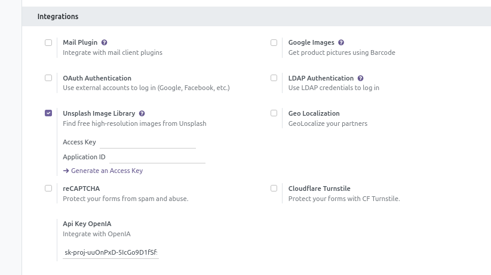
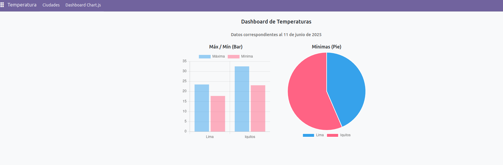
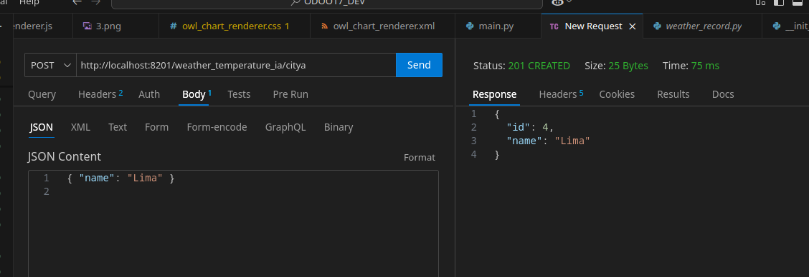

# Módulo que permite ubicar la temperatura mínima y máxima de las ciudades del Perú Con OpenAI - Odoo 17

Configuracion del ApiKey de openAI

Vista Formulario

Dashboard integrando Chart.js

Registro desde un endpoint

instalar: 
pip install openai==0.28